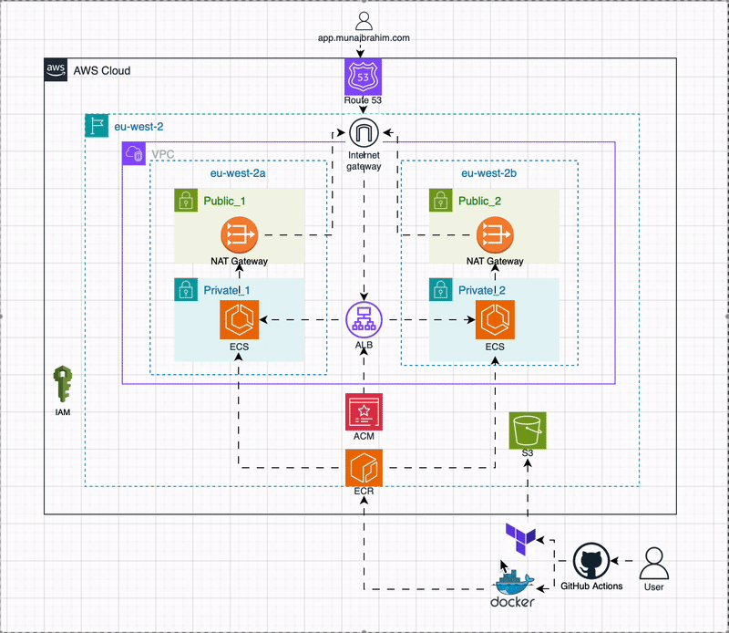
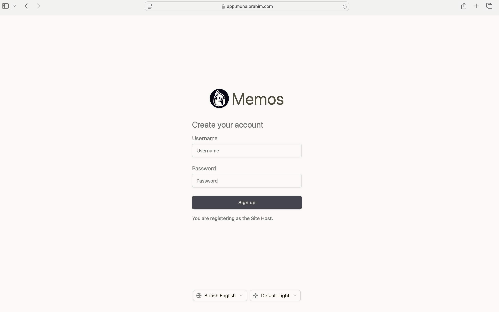
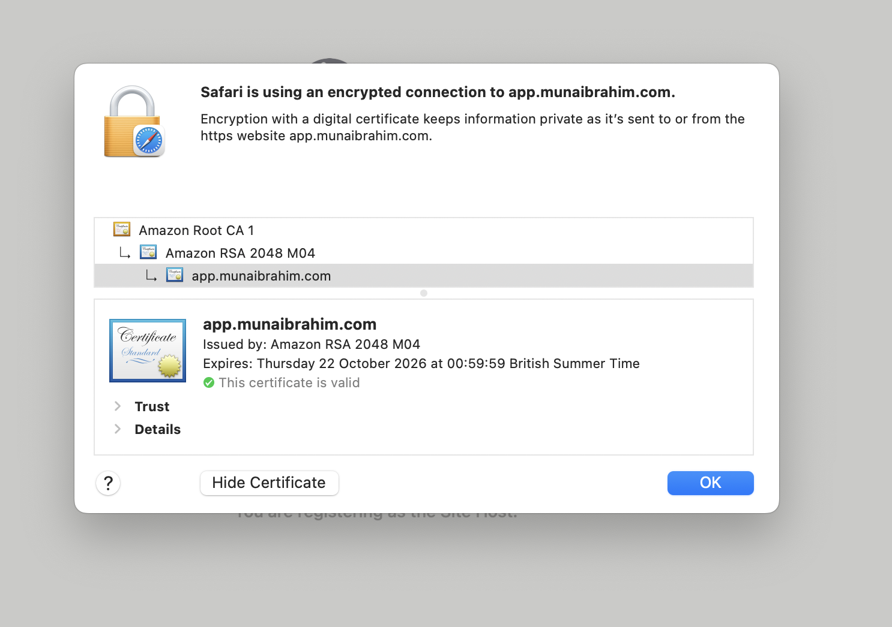
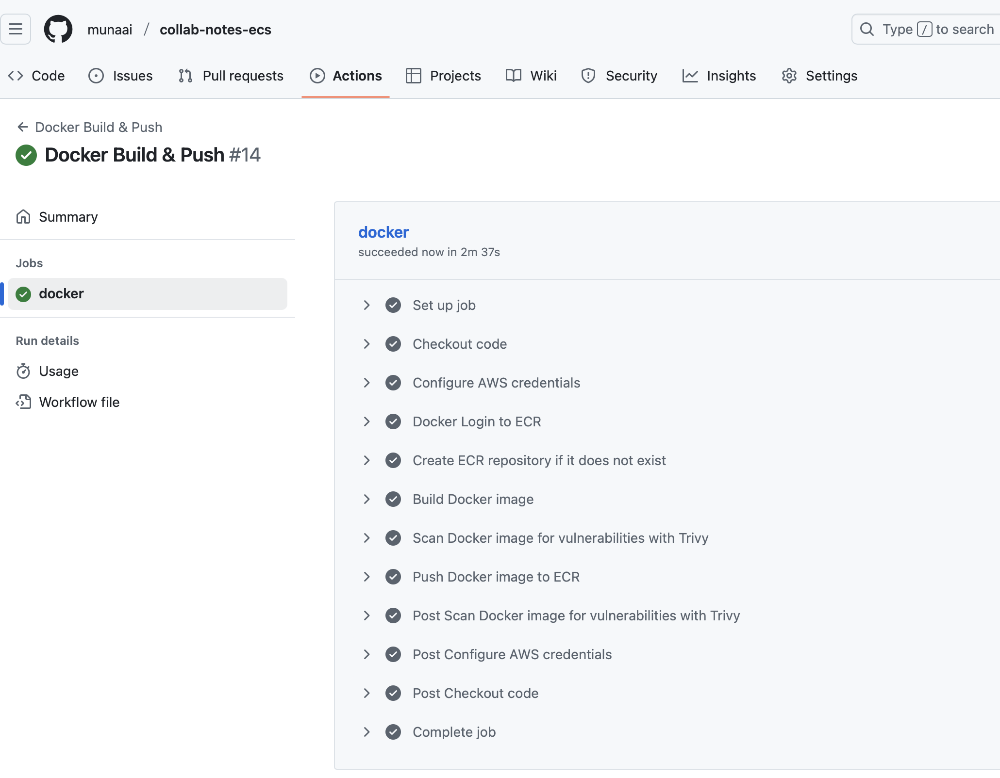
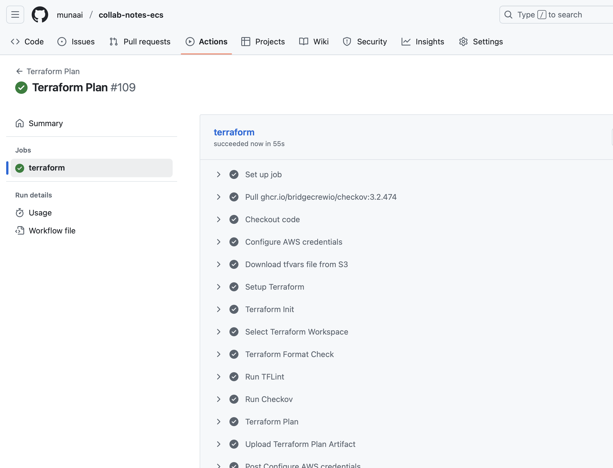
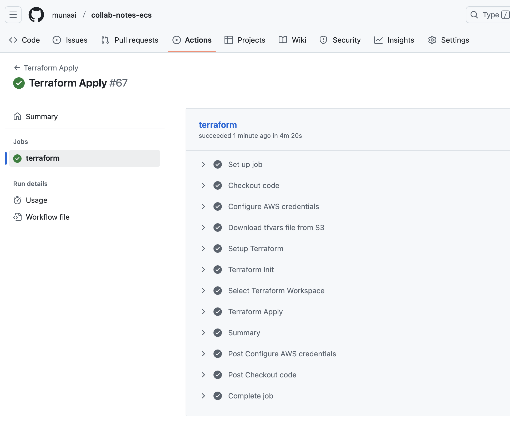
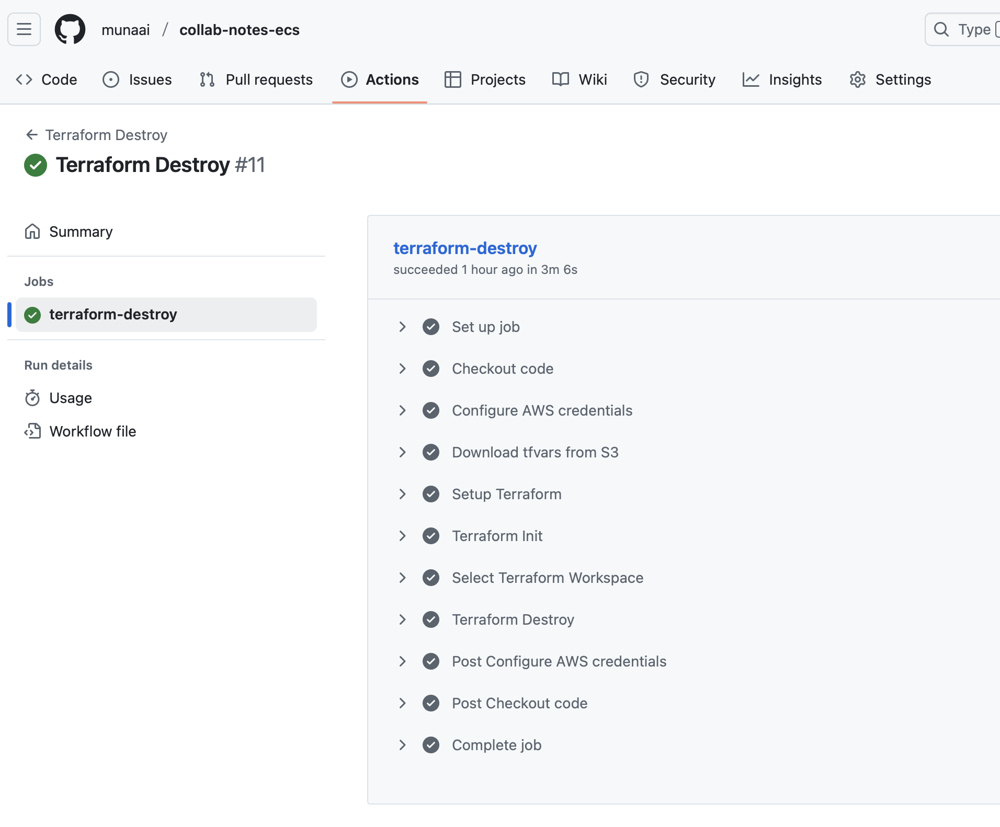

# Containerised Real-Time Collaborative Notes on ECS

A collaborative, real-time note editor where multiple users can edit and view simultaneously.
Updates are synchronised instantly across all clients, ensuring a smooth collaboration experience.

This setup automates the deployment of the application on **AWS ECS Fargate**, removing the need for manual resource provisioning through the AWS Console. By using **Terraform** and **GitHub Actions**, the entire infrastructure and deployment process is **repeatable, consistent, and efficient** - reducing human error and saving time across development and operations.

##  Architecture diagram

  

##  Features
- Fully automated infrastructure using Terraform, orchestrated via Terragrunt
- Docker container pushed to Amazon ECR
- ECS Fargate service behind an ALB with HTTPS
- **AWS WAF** protection for enhanced security  
- Security scanning with **Trivy** and **Checkov** 
- SSL certificate issued via ACM and validated through Route 53
- **GitHub Actions workflows** for:  
  - Docker image build & push  
  - Terragrunt plan, apply, and destroy  

## Terragrunt

This project uses **Terragrunt** to manage multiple Terraform environments (dev and prod) cleanly and safely.

Terragrunt centralises shared configuration such as remote state, provider settings, and common inputs, while allowing environment-specific values to be defined explicitly. This reduces duplication, prevents configuration drift, and makes environment isolation clearer.

All infrastructure changes are executed via **Terragrunt in CI/CD**, not by running Terraform directly.  

## Project Structure
<pre>
collab-notes-ecs/
├── .github/
│   └── workflows/
│       ├── docker.yml          # Build, scan, and push Docker image to ECR
│       ├── plan-dev.yml        # Terragrunt plan (dev)
│       ├── plan-prod.yml       # Terragrunt plan (prod)
│       ├── apply.yml           # Terragrunt apply (prod only)
│       └── destroy.yml         # Terragrunt destroy (manual)
│
├── app/
│   ├── Dockerfile
│   ├── .dockerignore
│   └── src/                    # Application source code
│
├── bootstrap/
│   ├── backend.tf              # S3 backend & DynamoDB state lock
│   ├── provider.tf
│   ├── main.tf
│   ├── variables.tf
│   └── outputs.tf
│
├── terraform/
│   ├── modules/                # Reusable Terraform modules
│   │   ├── vpc/
│   │   ├── alb/
│   │   ├── ecs_fargate/
│   │   ├── iam_roles/
│   │   ├── route53/
│   │   └── security_groups/
│   │
│   ├── workload/               # Root Terraform module
│   │   ├── main.tf
│   │   └── variables.tf
│   │
│   └── terragrunt/
│       ├── root.hcl            # Shared config (state, provider, common inputs)
│       ├── dev/
│       │   └── terragrunt.hcl  # Dev environment config
│       └── prod/
│           └── terragrunt.hcl  # Prod environment config

</pre>

## Local App Setup 💻
### Option 1: Run Locally Without Docker
<pre>
cd web
yarn install --frozen-lockfile
yarn dev   # http://localhost:5173
cd ..
go mod download
go run ./bin/memos  
Then visit: http://localhost:5173  — It will connect to http://localhost:8081 (backend).
</pre>  
### Option 2: Run Using Docker
<pre>
docker build -t collab-notes .
docker run -p 8081:8081 collab-notes
Then visit: http://localhost:8081 
</pre>

## Deployment Workflow

### Docker Build and Push
- Builds the application Docker image
- Scans the image using **Trivy**
- Uses a **non-root user** in the Dockerfile for improved container security
- Pushes the image to **Amazon ECR**

### Terragrunt Plan (Dev)
- Runs on pull requests or when manually triggered
- Configures AWS credentials using **OIDC**
- Runs **Terraform fmt**, **TFLint**, and **Checkov**
- Executes **`terragrunt plan`** against the **dev** environment
- Used to validate infrastructure changes before promotion to prod

### Terragrunt Plan (Prod)
- Runs after a successful Docker build or when manually triggered
- Configures AWS credentials using **OIDC**
- Runs **Terraform fmt**, **TFLint**, and **Checkov**
- Executes **`terragrunt plan`** against the **prod** environment
- Ensures production changes are reviewed before apply

### Terragrunt Apply (Prod Only)
- Runs after a successful **Terragrunt Plan (Prod)** or when manually triggered
- Applies infrastructure changes using **`terragrunt apply`**
- Provisions or updates AWS infrastructure in **production only**

### Terragrunt Destroy
- Manually triggered workflow
- Destroys all infrastructure managed by **Terragrunt**
- Used for controlled teardown of AWS resources

## Here is a demonstration

### Domain page

  

### SSL certificate

  

### Docker Build and Push to ECR

  

### Terragrunt Plan (Prod)

  

### Terragrunt Apply

  

### Teragrunt Destroy

  

